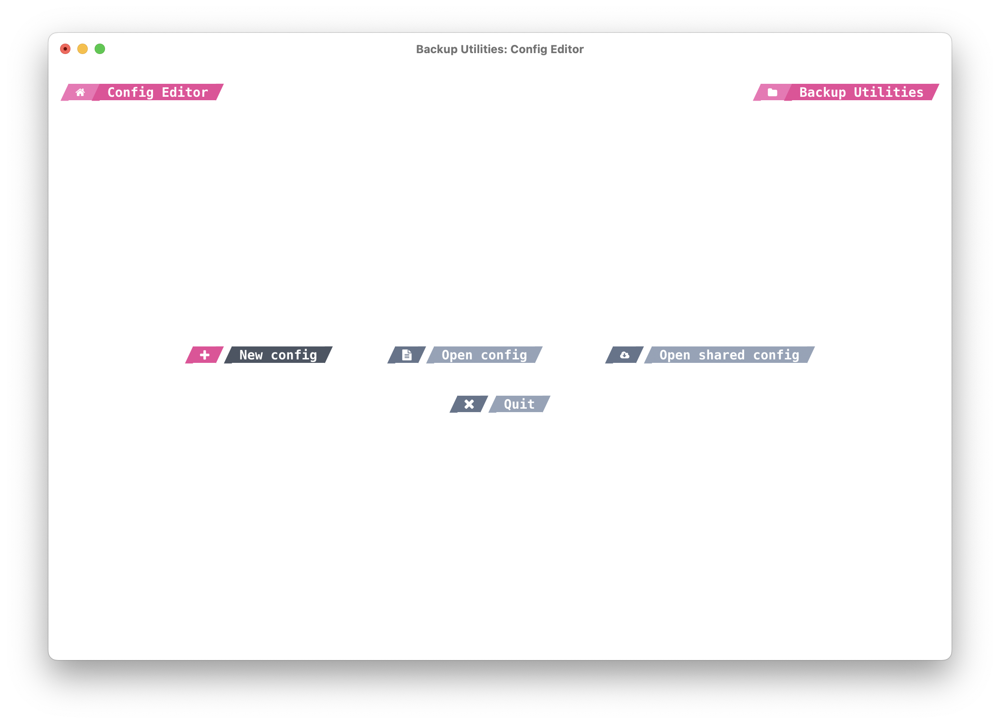

# 

## TUI Config editor app

TUI app for editing the configuration file of the Backup Utility Client. Written in C# using **.NET 8.0**.

## Usage

NerdFonts are required for the app to work properly. You can download them from [here](https://www.nerdfonts.com/font-downloads).

Available arguments:

-   `--8bit`: Force the app to use 8-bit colors instead of 24-bit colors.

Available environment variables:

-   `THEME`: `light` or `dark`. Defaults to `dark`.

-   `PRIMARY_COLOR`: `pink`, `red`, `yellow`, `green`, `blue`. Defaults to `pink`.

## Screenshots

The following screenshots are taken in iTerm2 with the MesloLGS NF font.

### Main screen

### Editing a value

### Sharing a config

## Building

The app depends on [Yoga](https://yogalayout.dev), a cross-platform layout engine, which must be built from source and added to the `bin/Debug/net8.0` directory before trying to run the app.
